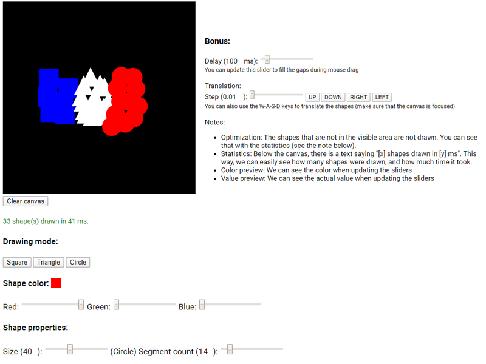

# UCSC - CSE160 - WebGL

Made for the CSE160 class at UCSC (Winter 2020). Written by Lilian Gallon.

### Assignments:

- Assignment 1: Painting - Grade ?/10

### Branches

- assignmentX: Assignment #X
- master: Contains the latest finished assignment

### Files

- .github/: github-related files
- libs/: contains all the libraries
- shaders/
  - fshader.glsl: Fragment shader (GLSL code)
  - vshader.glsl: Vertex shader (GLSL code)
- js/
  - utils.js: contains utility functions
  - init.js: contains everything to initialize the WebGL env
  - input.js: contains the variables which keep track of the user's input
  - graphics.js: contains the code to create, and draw things on the screen
- index.html: contains the HTML code (needs to call init() once ready)
- LICENSE: MIT license

### Libs

These libraries are provided by Khronos (the GL standardization body) & Kanda and Matsuda (2012):
- cuon-matrix.js
- cuon-utils.js
- webgl-debug.js
- webgl-utils.js

### License:

js/* & index.html files under the [MIT License](LICENSE).
