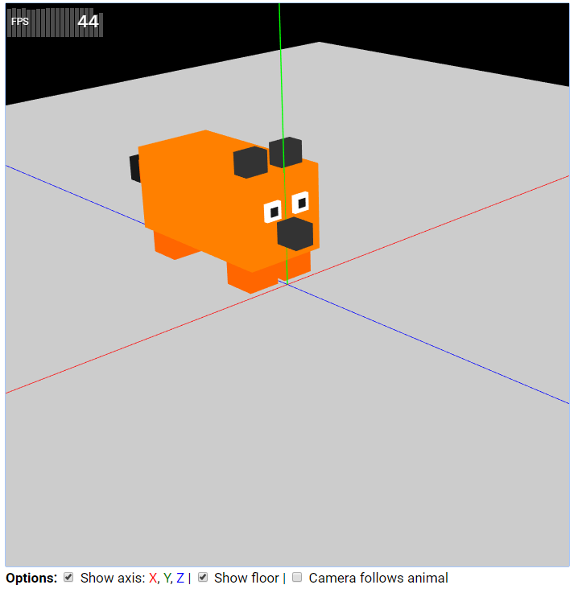

# UCSC - CSE160 - WebGL

Made for the CSE160 class at UCSC (Winter 2020). Written by Lilian Gallon.

### Assignments:

- Assignment 1: Painting - Grade 10/10

- Assignment 2: Animated Animal - Grade ?/10

### Branches

- assignmentX: Assignment #X
- master: Contains the latest finished assignment

### Files

- .github/: github-related files
- libs/: contains all the libraries
- shaders/
  - fshader.glsl: Fragment shader (GLSL code)
  - vshader.glsl: Vertex shader (GLSL code)
- js/
  - init.js: called when the HTML is loaded
  - main.js: called when WebGL is ready
  - *.js: see each files' header for details
- index.html: contains the HTML code
- LICENSE: MIT license

### Libs

These libraries are provided by Khronos (the GL standardization body) & Kanda and Matsuda (2012):
- cuon-matrix.js
- cuon-utils.js
- webgl-debug.js
- webgl-utils.js

The following libraries won't be taken into account for the grade, but help for the development:
- fpsmeter.min.js

### License:

js/* & index.html files under the [MIT License](LICENSE).
